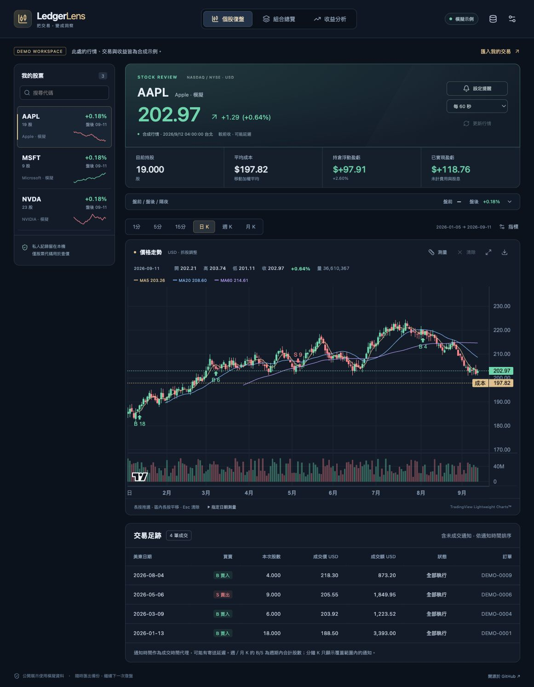
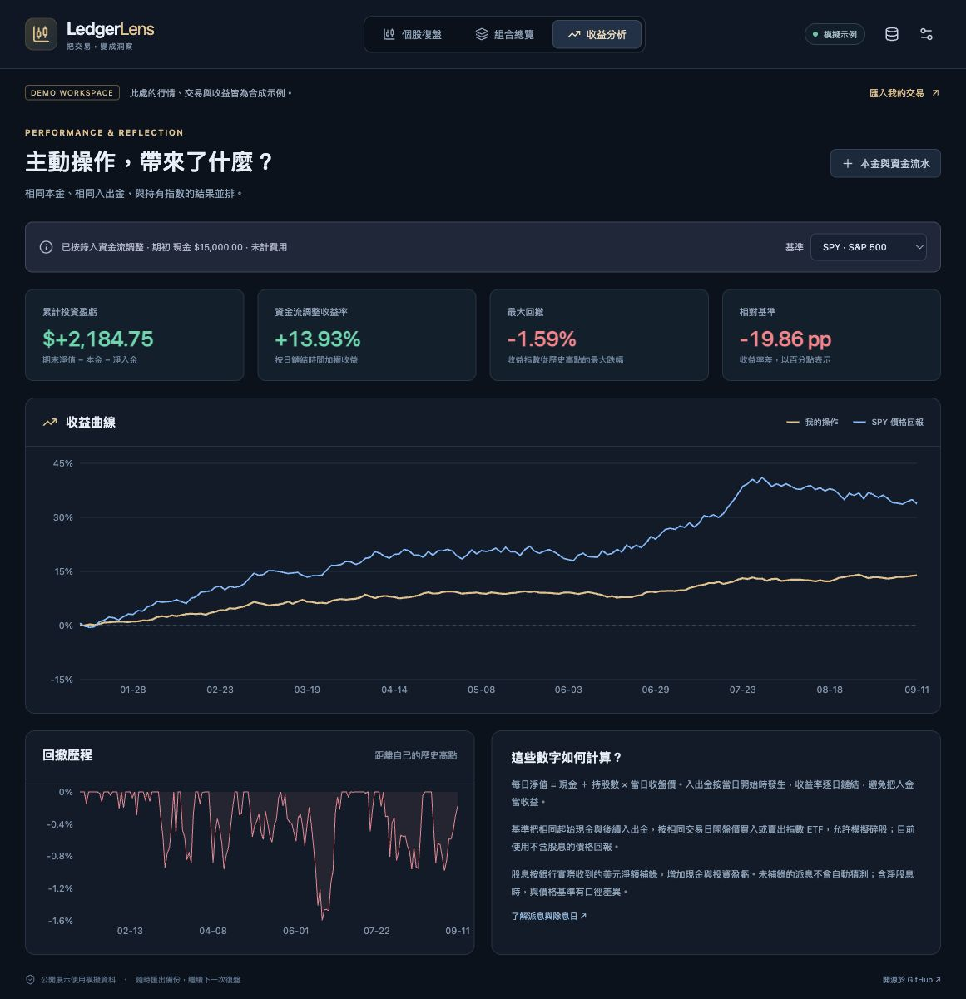

# LedgerLens · HSBC Stock Dashboard

把交易，變成洞察。以郵件成交記錄為起點的股票復盤工作台。

Next.js / React / TypeScript · 本機優先 · MIT · 不需要大模型



## 能做什麼

- **個股復盤**：日／週／月 K、1／5／15 分鐘 K、B/S 買賣點、成本線、MA、RSI、MACD、VWAP；所有指標可開關。
- **區間測量**：長按拖出選區，長按區內平移固定長度窗口，區外雙擊或 Esc 取消。測量卡是浮層，不改變圖表排版。
- **組合總覽**：移動加權平均成本、已實現／未實現盈虧、拆股處理，以及可排序的全部股票表格。
- **收益分析**：現金＋持倉淨值、資金流調整收益曲線、最大回撤、SPY／QQQ 基準比較。未知本金使用明確標識的估算。
- **Trade25**：每自然月買入＋賣出成交額、HKD 250,000 額度、手動匯率和其他成交額補錄；可隱藏面板。
- **本機提醒**：價格上／下穿、相對成本的浮盈／浮虧；命中一次即暫停，可選系統通知。
- **規則匯入**：批量 `.eml`／`.txt`／`.json`，或貼上單封通知正文。解析预覽、手動修正、通知事實去重，沒有大模型或郵箱帳號授權。
- **顯示偏好**：紅漲綠跌／綠漲紅跌、股票列表顯示价格／漲跌幅、日盤／盤前／盤後時段。



## 本機啟動

需要 Node.js 20.9 以上，建議 Node.js 24 LTS。

```bash
npm ci
npm run dev
```

開啟 [http://127.0.0.1:3000](http://127.0.0.1:3000)。預設是固定種子生成的**合成行情及交易**，不是真實投資績效。

```bash
npm run build
npm start
```

預設只綁定 `127.0.0.1`。需要公開展示時，使用你自己的部署平台啟動命令；**不要配置下面的私有資料環境變數**。

## 導入自己的記錄

### 1. 貼上郵件正文

打開右上角「資料與匯入」，複製交易郵件正文，解析後核對欄位。支持繁體／簡體中文及部分英文欄位，例如：

```text
訂單編號: EXAMPLE-001
股票代碼: AAPL
買賣方向: 買入
本次成交數量: 2
成交價格: 185.50
通知時間: 2026-06-01T22:35:00+08:00
通知狀態: 全部執行
```

這是格式示例，不是實際交易。時間必須含時區；不確定的日期、價格或數量不會自動猜測。

### 2. 批量原始郵件

`.eml` 是郵件的原始檔案，含郵件標頭和正文。若郵箱有「下載原文／另存為」，可以保存後批量選取。找不到匯出功能時可先用正文貼上，無須券商 Excel。

- 每批最多 100 個檔案、總計 30 MB，單檔 5 MB。
- `postal-mime` 解碼 MIME，規則解析器提取明確欄位。
- 僅使用**本次成交數量**入帳，累計量只參與通知識別。
- 同一訂單的分批成交分別保留；完全相同通知不重複入帳。
- 沒有成交量／成交價的通知仍可保存，填 0 並核對狀態，無 B/S 標記。
- 目前僅支持美元計價美股，郵件模板不匹配時手動修正，或提交**合成模板**改善規則。

### 3. 接續既有本機資料源

```bash
cp .env.example .env.local
```

在 `.env.local` 填入自己的舊版 `dashboard.json` 絕對路徑。可选 `PRIVATE_PERFORMANCE_FILE` 指向含 `initial_cash_usd` 和 `cash_flows_complete` 的 JSON。此文件应由你本機创建，项目不附带任何個人本金。

本機橋接每 60 秒查看檔案更新，合併新通知並保留瀏覽器補錄的資金流水。既有郵件抓取排程繼續更新原來的檔案即可，不需要重新抓取所有舊郵件。開源應用自身不登入或抓取郵箱。

## 資料与界面分離

```text
src/lib/importers/hsbc.ts  MIME／正文／舊資料轉換與去重
src/lib/types.ts           穩定的資料契約與 Zod 驗證
src/lib/ledger.ts          持倉、成本、已實現盈虧、月成交額
src/lib/performance.ts     淨值、現金流、收益、回撤、基準
src/lib/indicators.ts      MA、RSI、MACD、VWAP、週月聚合
src/lib/providers/yahoo.ts 行情供應器、快取、併發與退避
src/lib/use-workspace.ts   本機 IndexedDB 與更新協調
src/components/            顯示與互動，不依賴郵箱
src/app/api/local-data/    可選、預設關閉的本機檔案橋接
src/app/api/market/        只接收股票代碼、週期和日期
```

替換行情供應商，只需實現 `Market` 資料契約；增加券商，只需把通知轉成 `Notice`。帳本計算與 UI 無須知道郵箱來源。

## 收益口徑

詳見 [計算方法](docs/calculations.md)。幾個核心約定：

1. 持倉採**移動加權平均成本**，拆股改股數而不改總成本。期初假設無股票持倉，漏單或超額賣出會停止顯示相關盈虧。
2. 每日淨值 = 現金 + 持股 × 當日收盤價。入出金約定日初發生，按日鏈結時間加權收益；資料不完整標記估算。
3. 未知本金採扣除已錄入資金流後，完成買賣所需的最低現金估算，不能等同真實帳戶報酬。可以直接查看不依賴本金的持倉盈虧金额。
4. 基準使用同初始本金與同外部現金流，按當日開盤價交易可分割的 SPY／QQQ 份額；是**不含派息的價格回報**。
5. 股息按實際**淨入帳金額與入帳日**補錄，不以公共派息事件猜測扣稅或到帳。帳戶加入股息後，介面提示與價格基準的口徑差異。
6. 盈虧模型未扣費用或匯兌。Trade25 免佣額度與月費、監管費用不同；以銀行條款與紀錄為準。

## 行情與提醒的邊界

- Yahoo 公開行情沒有即時性或持續可用性保證。每秒選項代表**輪詢頻率**，不代表交易所逐筆實時行情；來源可能延遲、快取或限流。
- 日線快取 60 秒、分鐘快取 1 秒、同請求合併、最多 6 個供應商並發請求；429 後退避 60 秒。
- 1 分鐘資料通常只返回最近幾日，5／15 分鐘亦受供應商限制。未覆蓋的交易不會偽造 K 線或買賣點。
- 盤前後為最近可用分鐘收盤參考值；隔夜不提供時留空。日盤持倉估值不混入盘前／盤後價格。
- 成交時間来自通知時刻，可能晚於實際成交，分鐘 B/S 點僅為代理。
- 只有頁面開啟、在前景並持續取得行情時才評估提醒；報價超過 5 分鐘不觸發。不是券商自動交易功能。
- 生產使用可替換為有授權與服務保證的行情供應器；部署者負責遵守資料來源使用條款。

## 隱私與開源

- 倉庫只含程式、文檔及合成示例，不含原始郵件、交易匯出、帳戶資訊或私有資料路徑。
- 匯入記錄保存於瀏覽器 IndexedDB。原郵件正文不發送至服務端；行情請求只含股票代碼與日期。
- `.env*`、`private/`、`data/`、郵件、表格與壓縮備份均被 Git 忽略。
- `/api/local-data` 默認關閉，開啟時要求本機 Host 和同源訪問。它不是互聯網上的多用戶驗證系統；勿將啟用私有檔案橋接的服務公開。
- 定期下載完整 JSON 備份，清除瀏覽器資料会删除本機匯入和補錄。切換模擬示例會保留私人資料備份，可切回。

## 技術與授權

Next.js、React、Radix UI Dialog / Switch、TanStack Table、TradingView Lightweight Charts、Recharts、Lucide、Zod、Decimal.js、postal-mime、idb-keyval、Sonner。

原創程式採 [MIT](LICENSE)。第三方授權見 [THIRD_PARTY_NOTICES.md](THIRD_PARTY_NOTICES.md)。本項目與 HSBC、Yahoo、TradingView 無隸屬或官方背書關係。HSBC、Trade25 等名稱僅用於辨識通知格式及產品。

歡迎提交改進；請勿在 Issue 或 PR 貼上真實帳戶、訂單、郵件正文或個人交易備份。
